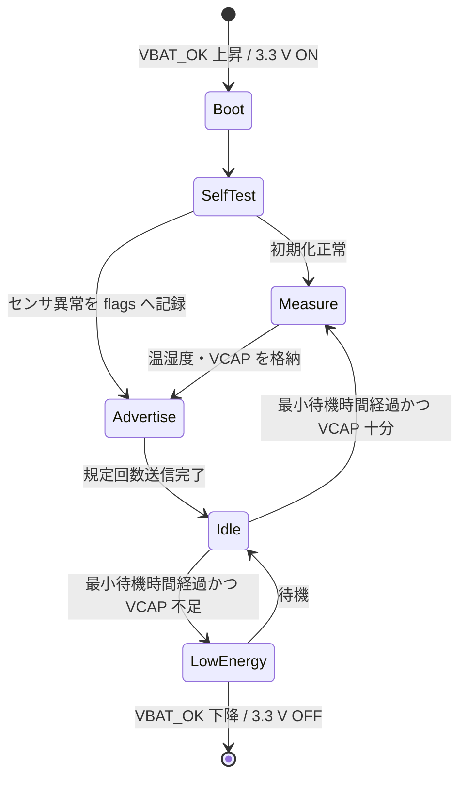

# センサノード ファームウェア実装方針

## 1. 目的と境界

MDBT50Q-U1MV2 内の nRF52840 で温湿度とスーパーキャパシタ電圧を取得し、BLE Advertising で顧客側へ送信する。PC 側の受信・保存・表示ソフトウェアは実装しない。

SDK は nRF Connect SDK `v3.4.0`、OS は Zephyr を採用する。接続型 GATT は初号機の必須範囲外とし、非接続 Advertising を基本とする。

## 2. 電源と状態遷移



`VBAT_OK` 上昇約 4.09 V、下降約 3.58 V のヒステリシスでハードウェア電源を制御する。送信後は System ON の tickless idle へ入り、RTC で起床する。nRF52840 の System OFF は RTC 起床できないため、初号機の周期待機には使わない。

起床周期は初期値 10 分とし、`VCAP >= 4.00 V` かつ前回送信から設定時間以上なら送信する。蓄電不足時は測定と送信を省略する。要求周期が確定したら Kconfig で変更する。

## 3. ソフトウェア構成

```text
sensor_node/
├── src/main.c              起動、状態遷移、エラー統合
├── src/power.c             VCAP 測定、送信可否
├── src/sensor.c            SHTC3 制御と CRC 確認
├── src/advertising.c       ペイロード生成、1M / Coded PHY
├── src/device_identity.c   機器 ID、通番、永続化
├── src/diagnostics.c       UART 試験コマンド
├── include/
├── prj.conf
└── Kconfig
```

ハードウェア依存の GPIO、I2C、ADC、UART は Devicetree alias から取得する。送信回数、送信出力、PHY、待機時間、しきい値は Kconfig で変更可能にする。

## 4. 起動シーケンス

1. ログを最小レベルで初期化し、量産設定では UART ログを無効化する。
2. リセット理由と前回エラーを取得する。
3. FICR の DEVICEID から 32 bit 機器 ID を生成する。
4. SAADC を校正し、スーパーキャパシタ電圧を複数回平均する。
5. SHTC3 を wake、低電力測定、CRC 確認、sleep の順で操作する。
6. NVS の通番を更新し、Advertising ペイロードを作る。
7. 指定 PHY / 出力 / 回数で送信する。
8. 周辺機能を停止して tickless idle へ入る。

SHTC3 が失敗しても送信自体は継続し、無効値とエラーフラグを載せる。ADC または Bluetooth 初期化失敗時は再試行回数を制限し、リセットループを作らない。

## 5. Advertising 仕様

### 5.1 無線設定

| 項目              |          初期値 | 変更範囲        |
| ----------------- | --------------: | --------------- |
| PHY               |              1M | 1M / Coded S=8  |
| TX power          |           0 dBm | -20 から +8 dBm |
| Advertising 間隔  |          150 ms | 100-1000 ms     |
| 1回の起床での送信 |            6 回 | 1-20 回         |
| 接続可否          | non-connectable | 固定            |

1M は legacy advertising で互換性を優先する。Coded PHY は extended advertising set を別設定で生成する。Zephyr の [Extended Advertising sample](https://docs.zephyrproject.org/latest/samples/bluetooth/extended_adv/README.html) を API 実装の基準とする。

### 5.2 ペイロード

Manufacturer Specific Data を使用する。評価時 Company Identifier は `0xFFFF` とし、製品出荷前に顧客または製造者の Bluetooth SIG Company Identifier へ置換する。

| Offset | 長さ | 型          | 内容                       |
| -----: | ---: | ----------- | -------------------------- |
|      0 |    1 | `uint8`     | protocol version、初期値 1 |
|      1 |    1 | bit field   | status / error flags       |
|      2 |    4 | `uint32_le` | device ID                  |
|      6 |    4 | `uint32_le` | sequence number            |
|     10 |    2 | `int16_le`  | 温度、0.01 degC            |
|     12 |    2 | `uint16_le` | 相対湿度、0.01 %RH         |
|     14 |    2 | `uint16_le` | スーパーキャパシタ電圧、mV |
|     16 |    2 | `uint16_le` | payload CRC-16/CCITT-FALSE |

温度無効値は `INT16_MIN`、湿度・電圧無効値は `UINT16_MAX` とする。リンク層 CRC に加えて payload CRC を持たせ、顧客側の保存・転送経路での破損も検出可能にする。

status flags:

| Bit | 意味                |
| --: | ------------------- |
|   0 | SHTC3 読取り失敗    |
|   1 | SHTC3 CRC 不一致    |
|   2 | VCAP ADC 異常       |
|   3 | 低エネルギー状態    |
|   4 | 前回 watchdog reset |
|   5 | NVS 読書き異常      |
| 6-7 | 予約、0             |

## 6. 永続化

- 通番と必要最小限の診断状態だけを Zephyr NVS に保存する。
- NVS は 2 セクタ以上を割り当て、wear leveling を利用する。
- 設定値はビルド時 Kconfig を正とし、初号機では無線経由設定変更を実装しない。
- 通番書込み失敗時も送信を継続し、NVS エラーフラグを立てる。

## 7. UART 診断

通常動作では UART を停止する。テストストラップ検出時だけ 115200 bps、8-N-1 で次を提供する。

| コマンド        | 動作                            |
| --------------- | ------------------------------- |
| `status`        | VCAP、温湿度、flags、通番を表示 |
| `measure`       | 1 回測定                        |
| `adv 1m`        | 1M PHY で試験送信               |
| `adv coded`     | Coded PHY で試験送信            |
| `txpower <dBm>` | RAM 上の送信出力を変更          |
| `reset`         | ソフトウェアリセット            |

顧客 PC ソフトとの正式インターフェースにはしない。UART 端子からの逆給電を避けるため、無給電基板へ USB-UART を接続しない。

## 8. 低消費電力方針

- SHTC3 は測定時だけ wake し、完了後に sleep command を送る。
- SAADC、UART、高周波クロックは使用直後に停止する。
- 通常ログ、LED、シェル、デバッグ機能は release 設定で無効化する。
- まず 0 dBm / 1M / 6 回で測定し、距離不足時だけ Coded PHY または送信出力を上げる。
- 送信サイクル全体のエネルギーを電源アナライザで測り、推定値ではなく実測で待機条件を決める。

## 9. テスト方針

| レベル            | 確認内容                                                  |
| ----------------- | --------------------------------------------------------- |
| Unit              | ペイロード encode/decode、CRC、単位変換、しきい値判定     |
| Native simulation | SHTC3 / ADC エラー時の状態遷移、NVS 異常                  |
| DK                | 1M / Coded Advertising、TX power、NVS、UART               |
| カスタム基板      | I2C、SAADC 校正、SWD、低電圧リセット、逆給電              |
| システム          | 充電から送信、受信成功率、ピーク電流、1サイクルエネルギー |

最低限の受入確認:

- 3.3 V 立上り後に 1 回以上、有効なペイロードを送る。
- SHTC3 切断時もエラー付き Advertising を送る。
- VCAP 不足時に送信せず、リセット反復しない。
- 1M と Coded PHY の双方で設定した回数を送る。
- 顧客へ提示したデコード仕様とバイト列 fixture が一致する。

## 10. 実装順

1. DK 上で board 非依存のペイロードと Advertising を実装する。
2. SHTC3 と SAADC を追加し、fixture を用いた Unit test を作る。
3. NVS、通番、状態遷移、tickless idle を追加する。
4. Coded PHY、TX power、送信回数を Kconfig 化する。
5. カスタム board 定義と UART 診断を追加する。
6. 実基板で電力測定し、しきい値と送信条件を更新する。
